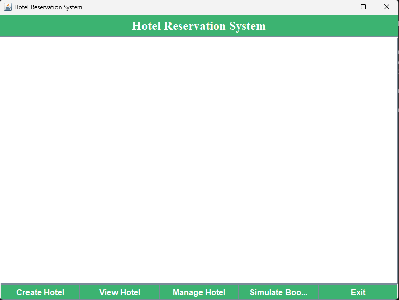
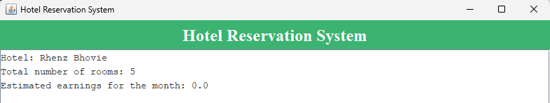

Now that I can see the structure with screenshots, here's an updated **README** file that you can use for your **Simple Hotel Booking GUI** project. This version includes instructions on how to run the project, a folder structure, and sample screenshots directly from your repository.

---

# Simple Hotel Booking GUI

## Overview
This project is a Java-based graphical user interface (GUI) application for managing hotel reservations. The application allows users to book rooms, view current reservations, and cancel bookings through an intuitive user interface.

## Requirements
- **Java JDK** (Java Development Kit) installed.
- **JavaFX** or any relevant GUI library (if required by the project).
- **Command line terminal** (Linux/Mac) or Command Prompt (Windows).

## How to Run the Project

### Step 1: Navigate to the `src` Directory
After downloading or cloning the project, open your terminal or command prompt and navigate to the `src` folder:
```bash
cd src
```

### Step 2: Compile the Java Files
To compile the Java files, run the following command inside the `src` folder:
```bash
javac *.java
```

### Step 3: Run the Application
After the compilation, run the `Driver.java` or the main file that starts the GUI application:
```bash
java Driver
```

### Sample Screenshots
Here are some sample screenshots of the application:

#### 1. Main Page


#### 2. View Hotel


---

### Folder Structure
- **src/**: This folder contains all the Java source code files.
- **screenshot/**: This folder contains screenshots showing the system in action, such as the main page and hotel view.

---

You can now copy this content into a `README.md` file, and the images will be included as long as they are in the `screenshot` folder as shown in the structure.
